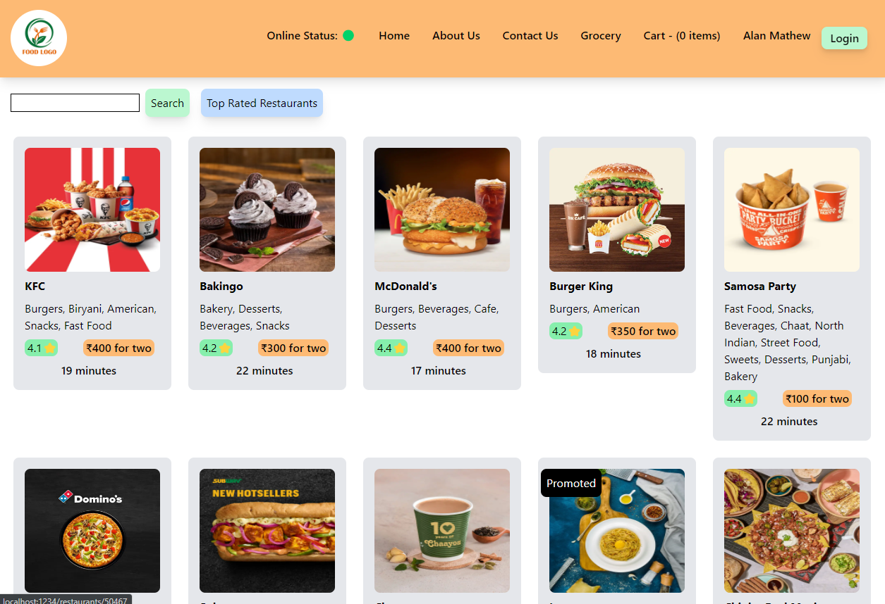
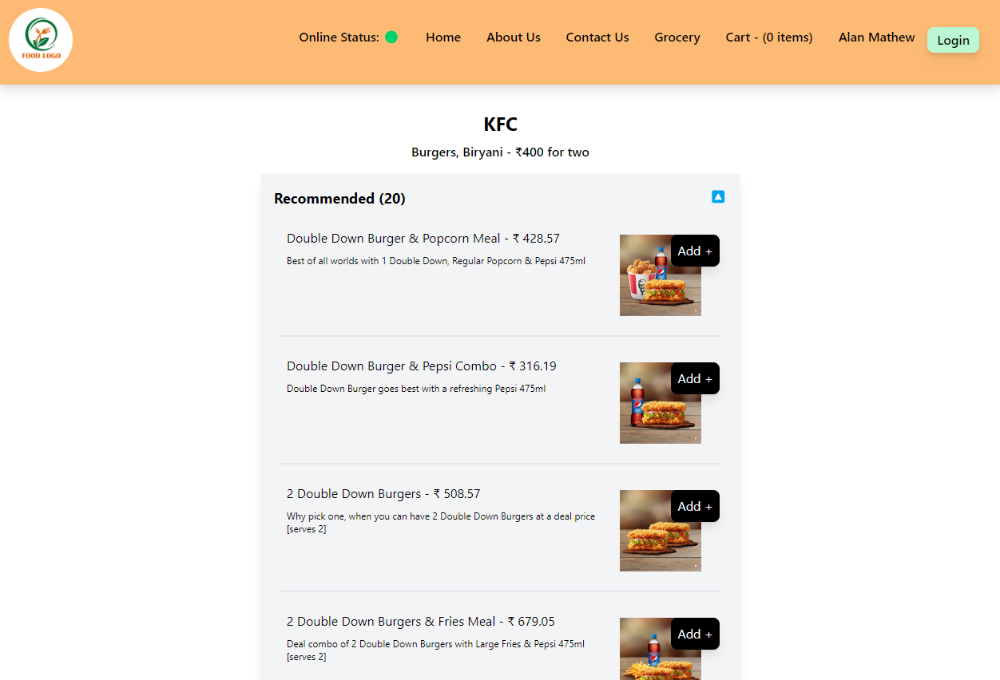

# Design for our food delivery app

# Header

    - Logo
    - Nav-items

# Body

    - Search
    - RestaurantContainer
        - RestaurantCard
             - RestaurantImage, RestaurantName, Cuisine, Rating, etc

# Footer

    - Copyright
    - Links
    - Address
    - Contact

# Images of the Web-App

# Redux Toolkit

- Install @reduxjs/toolkit and react-redux
- Build our store
- Connect our store to our app
- Slic (cartSlice)
- dispatch (action)
- Selector

# Types of Testing (developer)

- Unit Testing
- Integration Testing
- End to End Testing - e2e Testing

# Setting up Testing in our app

- Install React Testing Library
- Installed jest
- Installed Babel dependencies
- Configure Babel
- Configure Parcel Config file to disable default babel transpilation
- Jest Configuration -> Jest - npx jest --init
- Install jsdom library
- Install @babel/preset-react -> to make JSX work in test cases
- Install @testing-library/jest-dom
